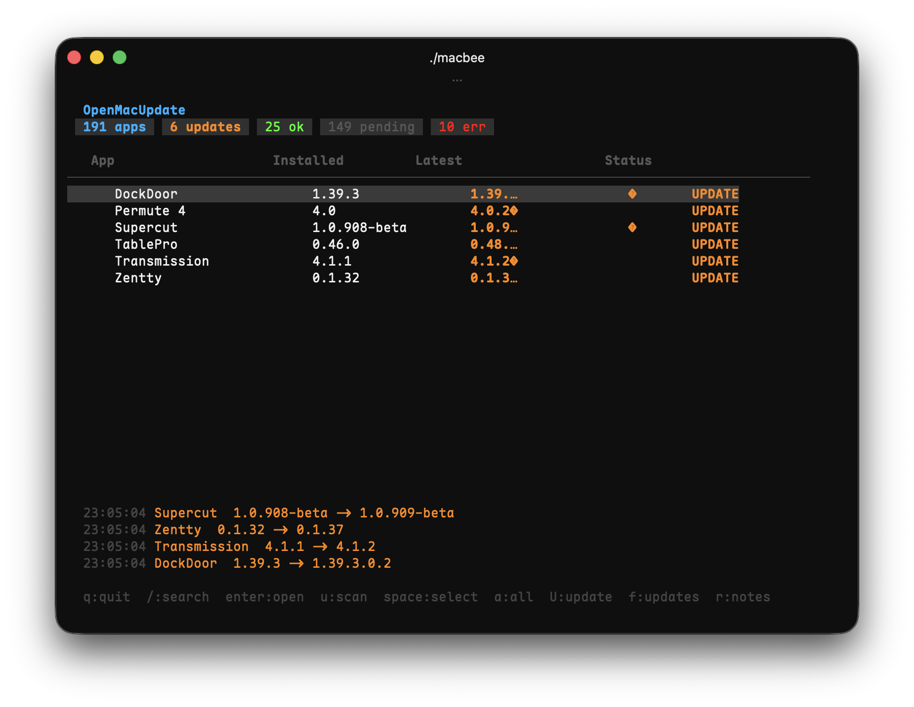

# OpenMacUpdate

**Actualiza todas tus apps de Mac — gratis, código abierto, sin registro**

OpenMacUpdate escanea tus aplicaciones instaladas y busca actualizaciones a través de **Sparkle**, **Homebrew Casks** y **Mac App Store** — todo desde una sola terminal.

> **60,000+ aplicaciones** en la base de datos. Completamente open source. Sin registro, sin rastreo, sin límites.



---

## Características

- **🔍 Escaneo inteligente** — escanea `/Applications` y `~/Applications`, analiza `Info.plist`
- **📡 Verificación Sparkle** — obtiene automáticamente feeds appcast XML
- **🍺 Homebrew Casks** — verificación mediante `brew outdated --cask`
- **🏪 Mac App Store** — verificación mediante `mas outdated`
- **⚡ Verificación paralela** — todos los feeds se verifican simultáneamente
- **🎯 ARM/Intel** — selección automática del feed correcto para tu arquitectura
- **📦 Base de datos remota** — siempre actualizada desde GitHub
- **💾 Caché inteligente** — caché local de 24h, funciona sin conexión
- **🎨 TUI rico** — estados con color, barra de progreso, registro en vivo

---

## Base de datos

**60,000+ aplicaciones macOS** incluidas:

| Campo | Descripción |
|-------|-------------|
| Sparkle feed URLs | Enlaces directos a appcast XML |
| Feeds ARM/Intel | Feeds específicos por arquitectura |
| Nombres Homebrew cask | Para integración con `brew upgrade --cask` |
| Reglas de ignorar | Aplicaciones del sistema, instaladores, etc. |
| Firmas de código | Verificación de identidad del desarrollador |
| URLs de notas de versión | Enlaces directos a changelogs |

La base de datos se descarga del repositorio en cada ejecución y se cachea localmente por 24 horas. Se aceptan PRs para agregar aplicaciones.

---

## Instalación

### Vía Homebrew (recomendado)

```bash
brew tap yakushevhk/tap
brew install --cask macbee
```

### Desde código fuente

```bash
git clone https://github.com/yakushevhk/OpenMacUpdate.git
cd OpenMacUpdate
go build -o macbee .
./macbee
```

### Requisitos

- **macOS**
- **Homebrew** (opcional, para integración cask)
- **mas-cli** (opcional, para integración App Store)

```bash
brew install mas
```

### Actualizar

```bash
brew upgrade --cask macbee
```

---

## Uso

| Tecla | Acción |
|-------|--------|
| `↑↓` | Navegación |
| `enter` | Abrir aplicación |
| `u` | Verificar todas las apps |
| `space` | Seleccionar/deseleccionar |
| `a` | Seleccionar/deseleccionar todas |
| `U` | Actualizar seleccionadas |
| `f` | Filtro (actualizaciones → todas → errores) |
| `/` | Buscar |
| `r` | Abrir notas de versión |
| `q` | Salir |

---

## Cómo funciona

```
┌─────────────────────────────────────────────────┐
│  1. Escanear /Applications + ~/Applications    │
│     └─ Leer Info.plist → BundleID, versión     │
│                                                 │
│  2. Cargar base de datos (GitHub → caché → offline)│
│     └─ Mapear BundleID → Feed URL              │
│                                                 │
│  3. Verificar actualizaciones (en paralelo)     │
│     ├─ Sparkle: obtener appcast XML            │
│     ├─ Homebrew: brew outdated --cask           │
│     └─ App Store: mas outdated                  │
│                                                 │
│  4. Comparar versiones y mostrar               │
│     └─ Comparación semántica de versiones      │
│                                                 │
│  5. Actualizar (opcional)                       │
│     ├─ Sparkle: curl + abrir DMG/ZIP           │
│     ├─ Homebrew: brew upgrade --cask            │
│     └─ App Store: mas upgrade                   │
└─────────────────────────────────────────────────┘
```

---

## Stack tecnológico

| Componente | Tecnología |
|------------|------------|
| Lenguaje | Go 1.26 |
| Framework TUI | [Bubble Tea](https://github.com/charmbracelet/bubbletea) |
| Componentes UI | [Bubbles](https://github.com/charmbracelet/bubbles) |
| Estilos | [Lip Gloss](https://github.com/charmbracelet/lipgloss) |
| Parsing plist | [howett.net/plist](https://howett.net/plist) |
| Base de datos | JSON (60K+ apps, mantenida por la comunidad) |

---

## Contribuir

El proyecto es **completamente open source** bajo licencia MIT. Puedes hacer lo que quieras con él.

- **Agregar apps** — edita `db/apps.json`, envía PR
- **Reportar bugs** — abre un issue
- **Agregar funciones** — fork, branch, PR
- **Mejorar TUI** — el código está en `tui/tui.go`

---

## Licencia

[MIT License](LICENSE) — Haz lo que quieras.

---

**Construido con Go + Bubble Tea** · Base de datos de la comunidad open source
